# BLACKOUT Swarm Coordination

> **A decentralized swarm simulation platform for drones, rovers, IoT nodes, and AI-enabled mission control**
>
> Built for the Vertex Swarm Challenge 2026  
> Tech stack: **Next.js + React + TypeScript + Three.js/r3f + Zustand + YOLOv8 + ROS2 bridge + Tashi Vertex SDK + FoxMQ P2P**

---

## Judge quick path (~5 minutes)

1. **Coordination SSOT** — read `swarm/coordination/state_machine.py` (pure FSM + `# WHY:` decision comments).
2. **Diagrams** — `docs/state-machine.mmd`, `docs/roles.mmd`, and `docs/ARCH.md`.
3. **One-command sim** — `make demo` → `docker compose` brings up Webots (`worlds/blackout_swarm.wbt`) plus the ROS 2 swarm image (`docker/Dockerfile.ros2`). Details: `docs/SETUP.md`.
4. **Executable spec** — `make test-coord` runs `tests/test_state_machine.py` + `tests/golden_scenarios.py` (install `requirements-coord.txt` first).
5. **Failure injection** — `python demo/injection_ui.py` then `curl -X POST http://127.0.0.1:8099/inject/kill/<id>` (wire `DEMO_KILL_CMD` for real kills).

> Note: this monorepo’s **web app** lives in `src/` (TypeScript). Python coordination modules live under `swarm/` to avoid mixing languages in the same tree.

---

## Table of Contents

1. [Project Overview](#project-overview)
2. [Why This System Exists](#why-this-system-exists)
3. [Key Capabilities](#key-capabilities)
4. [Architecture Overview](#architecture-overview)
5. [Repository Layout](#repository-layout)
6. [Core Runtime](#core-runtime)
7. [Simulation Scenarios](#simulation-scenarios)
8. [Drone Physics & Motion Model](#drone-physics--motion-model)
9. [IoT Mesh & Network Layer](#iot-mesh--network-layer)
10. [Vertex / FoxMQ Coordination](#vertex--foxmq-coordination)
11. [Vision Pipeline](#vision-pipeline)
12. [ROS2 / PX4 / Hardware Bridge](#ros2--px4--hardware-bridge)
13. [Mobile Companion App](#mobile-companion-app)
14. [Performance Targets & Benchmarks](#performance-targets--benchmarks)
15. [Simulation Data Model](#simulation-data-model)
16. [Rendering Pipeline](#rendering-pipeline)
17. [State Management](#state-management)
18. [Deployment](#deployment)
19. [Development Workflow](#development-workflow)
20. [Testing Strategy](#testing-strategy)
21. [API Reference](#api-reference)
22. [Observability & Debugging](#observability--debugging)
23. [Security & Failure Modes](#security--failure-modes)
24. [Hackathon Demo Script](#hackathon-demo-script)
25. [Roadmap](#roadmap)
26. [Contributing](#contributing)
27. [License](#license)

---

## Project Overview

BLACKOUT Swarm Coordination is a **mission-oriented simulation and orchestration platform** for cooperative drone and rover teams operating in communication-degraded environments. The system is designed to demonstrate how a swarm can:

- discover peers without a central server,
- maintain shared state across unreliable links,
- coordinate roles such as explorer, relay, and standby,
- detect victims using onboard vision,
- hand off tasks across robots and network layers,
- and stay operational when the cloud is unavailable.

This repository is intentionally built as a **demo-to-deployment bridge**. It combines a high-fidelity simulation front end with real coordination primitives and a set of hardware integration points for ROS2, PX4, and video streams.

The core product story is simple: **machines should coordinate with machines directly**. The UI exists to visualize and control that coordination, not to replace it.


## Why This System Exists

A conventional robotics dashboard often acts like a command center. It observes a fleet, receives telemetry, and issues commands from one place. That architecture is easy to understand, but it creates a weak point: if the server goes down, the swarm becomes harder to observe and coordinate.

BLACKOUT Swarm Coordination is meant to show a different shape:

- the swarm talks laterally through Vertex and FoxMQ,
- the UI attaches to the live state of the swarm rather than owning it,
- the simulation can survive degraded connectivity,
- and state is replicated in ways that favor continuity over perfect central control.

This matters in environments such as:

- collapsed tunnels,
- disaster response zones,
- warehouses with blocked radio paths,
- mixed robot fleets,
- and edge deployments where internet access is partial or absent.

The repository is structured so that each major capability can be demonstrated independently, then combined into a complete mission flow.

---

## Key Capabilities

### 1. Multi-agent coordination
The platform models drone teams, ground robots, IoT nodes, and mission logic using a shared runtime state.

### 2. Real-time 3D simulation
Three.js and Cannon-es drive a live scene with physics, movement, and role-based behavior.

### 3. P2P mesh logic
Vertex and FoxMQ are used to support decentralized messaging, shared state, and consensus-driven coordination.

### 4. Vision-assisted search
YOLOv8 is used to simulate victim detection and multi-modal confidence fusion.

### 5. Hardware integration
The system includes bridging logic for ROS2 topics and PX4/MAVLink control.

### 6. Mobile visibility
A React Native companion layer extends monitoring and control to mobile devices.

### 7. Hackathon-ready demo flow
The scenarios are designed to be shown quickly while still making the technical architecture legible.


## Architecture Overview

The platform is organized into four major layers:

1. **Presentation Layer**  
   The web UI, visualization canvas, scenario controls, telemetry panels, charts, and mobile surfaces.

2. **Simulation Core**  
   The swarm coordinator, drone physics, route selection, mission state, and event processing.

3. **Coordination Layer**  
   Vertex and FoxMQ provide peer discovery, distributed state exchange, and mission-grade coordination.

4. **Hardware Bridge**  
   ROS2 and PX4 connect the simulation to actual drone control and sensor interfaces.

### High-level architecture diagram

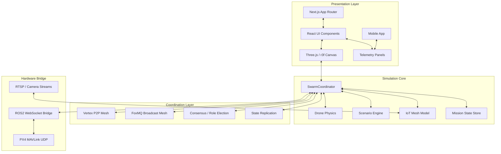

### Data flow at runtime

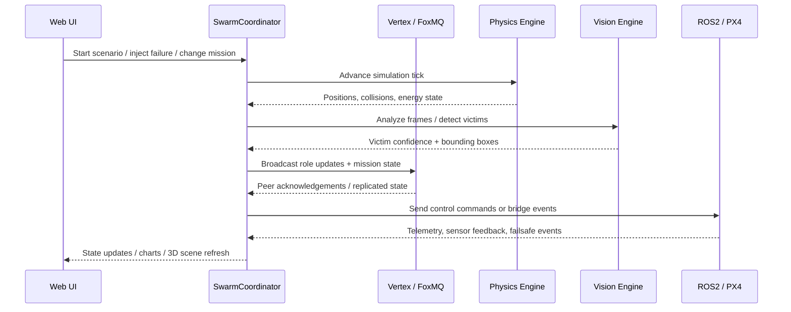


## Repository Layout

The repository is structured to keep simulation, UI, and integration concerns separated.

```text
BLACKOUT Swarm Coordination/
├── app/                          # Next.js App Router
│   ├── (landing)/                # Landing and introduction screens
│   ├── (simulation)/             # 3 scenario views
│   ├── (drone)/                  # Fleet management UI
│   └── (iot)/                    # Network and mesh views
├── lib/
│   ├── swarm/                    # Core simulation & scenario logic
│   ├── tashi-sdk/                # Vertex + FoxMQ wrappers
│   ├── vision/                   # YOLOv8 ONNX runtime helpers
│   ├── physics/                  # Drone and object physics
│   └── hardware/                 # ROS2 and PX4 bridge code
├── components/
│   ├── ui/                       # Reusable UI primitives
│   ├── drone/                    # Drone cards, status widgets, radar
│   └── charts/                   # Recharts + D3 visualizations
├── public/
│   ├── models/                   # GLTF assets and mission props
│   └── yolov8n.onnx              # Vision model artifact
├── docs/
│   └── hackathon-submission.md   # Submission packet and notes
└── mobile/                       # React Native companion app
```

### What each layer owns

- `app/` owns pages, routes, and shell-level UI composition.
- `lib/swarm/` owns the actual mission simulation rules.
- `lib/tashi-sdk/` owns communication abstractions and coordination helpers.
- `lib/vision/` owns inference and confidence fusion.
- `lib/physics/` owns movement and collision behavior.
- `lib/hardware/` owns real-world interfaces.
- `components/` owns presentation, visual encodings, and control widgets.
- `docs/` contains submission material and supporting explanations.
- `mobile/` extends the mission view to field operators.

---

## Core Runtime

At the center of the platform is a swarm controller. It acts as a state machine that updates every frame or simulation tick.

Typical responsibilities include:

- creating agents,
- assigning roles,
- updating motion and collisions,
- handling peer discovery and liveness,
- ingesting sensor and vision events,
- keeping shared mission state coherent,
- and exposing updates to the UI.

### Core loop

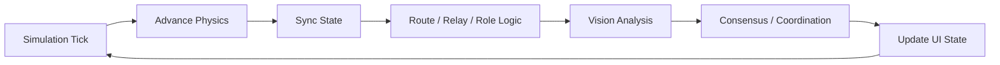

### Design principle

The runtime should always answer these questions:

1. **What is happening in the world right now?**
2. **Which agent is responsible for the next move?**
3. **Who knows what, and how recently?**
4. **What is safe to display or command?**
5. **What is the fallback when a node disappears?**

If a module cannot answer one of those questions clearly, the module is too large or too ambiguous.


## Simulation Scenarios

The repository centers on three demonstrable missions. They are intentionally different so the same core engine can prove range, not just one narrow trick.

### Scenario 1: Drone Warehouse Operations

This scenario simulates a warehouse with moving shelves, narrow aisles, and reactive drone traffic.

Primary behaviors:

- dynamic restocking,
- congestion avoidance,
- shelf-aware routing,
- obstacle reaction,
- and throughput optimization.

It is useful for showing how the swarm handles high-density motion while still staying coordinated.

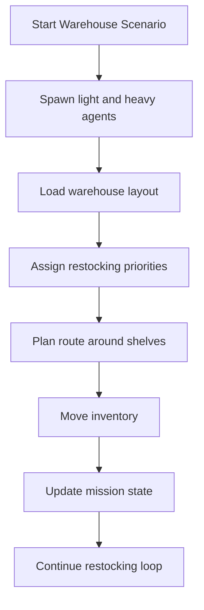

Key characteristics:

- multiple drones with different payload classes,
- shelf motion and aisle constraints,
- collision avoidance,
- and measurable restock speed improvements.

### Scenario 2: Predator Evasion Security

This scenario focuses on survival and avoidance rather than delivery.

Primary behaviors:

- threat detection,
- orthogonal scatter,
- regrouping after a threat passes,
- and maintaining mission continuity under sudden danger.

The design goal is to show that the system can react fast enough to prevent collisions and preserve the swarm.

### Scenario 3: Stake-Weighted Victim Rescue

This scenario uses vision and consensus to decide how rescue work should be assigned.

Primary behaviors:

- victim detection,
- confidence fusion,
- stake-weighted proposal selection,
- multi-swarm handoff,
- and rescue prioritization.

This scenario is the most representative of the platform’s “decision under uncertainty” story.

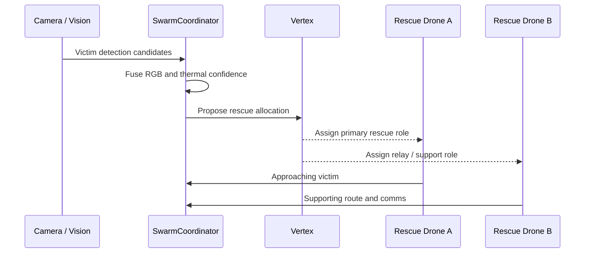


## Drone Physics & Motion Model

A useful simulation is not just a set of markers floating in space. The system models drones as physical bodies with movement constraints and realistic control behavior.

### Motion model goals

- believable acceleration and inertia,
- altitude-dependent thrust behavior,
- collision response,
- payload impacts on maneuverability,
- and failure states that feel operational rather than abstract.

### Physics layer responsibilities

- body creation,
- velocity and thrust application,
- collision detection,
- altitude management,
- drift correction,
- and state recovery after emergency behavior.

### Example motion considerations

The system should encode how motion changes when:

- battery is low,
- payload is attached,
- wind or obstacle pressure is present,
- the drone is a relay and must hold position,
- or the drone is performing a fail-safe descent.

### Drone lifecycle diagram

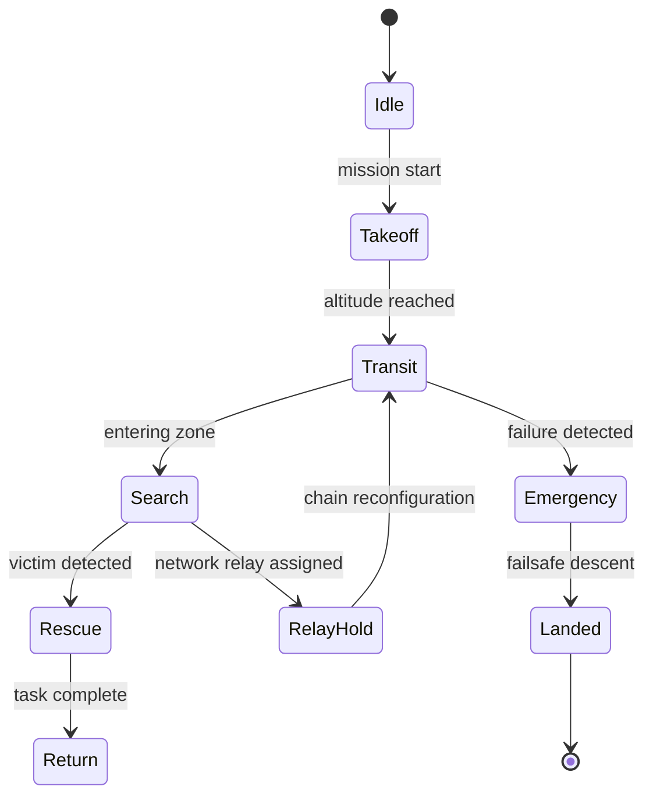

---

## IoT Mesh & Network Layer

The IoT mesh simulation is important because the challenge is not only the drones themselves. It is also about the environment they inhabit.

The network layer should model:

- range attenuation,
- hop count effects,
- latency growth,
- packet loss under degradation,
- dynamic relay topologies,
- and low-bandwidth operational constraints.

### Network model goals

1. Simulate meaningful communication degradation.
2. Keep the mission functional in low-bandwidth conditions.
3. Avoid turning the mesh into a fake “always perfect” network.
4. Make the failure modes legible in the UI.

### Example mesh behavior

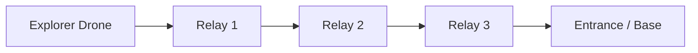

As depth or distance increases, the system should reflect:

- increasing one-way latency,
- lower message delivery probability,
- greater importance of relay placement,
- and the need for role re-election.

### Useful network indicators in the UI

- active peers,
- heartbeats received,
- packet loss estimate,
- current hop path,
- role assignment,
- and relay health.


## Vertex / FoxMQ Coordination

The coordination layer is the core differentiator. It is the part of the stack that makes the swarm feel like a swarm instead of a set of isolated nodes.

### Coordination responsibilities

- peer discovery,
- distributed heartbeats,
- role election,
- state sharing,
- failover and re-election,
- and order-preserving message exchange.

### Expected behavior

A node should be able to:

- join the mesh,
- announce itself,
- learn who else is alive,
- exchange its role and depth,
- receive a mission assignment,
- relay state as needed,
- and recover if a peer disappears.

### Coordination state diagram

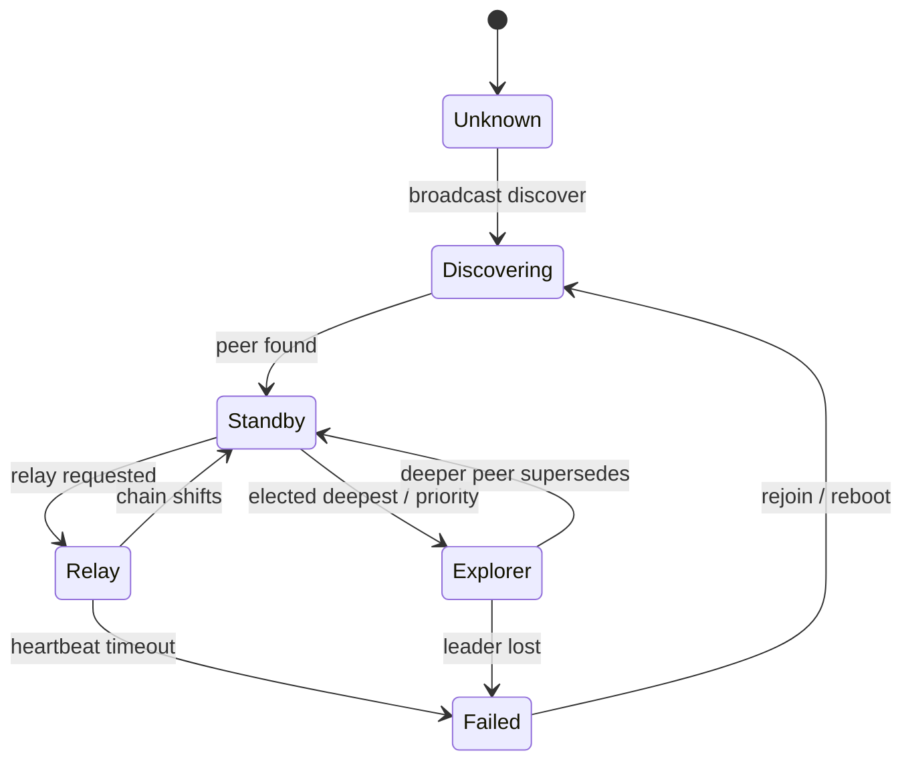

### State types worth replicating

- node identity,
- last-seen timestamp,
- current role,
- mission depth,
- relay chain membership,
- victim alerts,
- and health status.

### Coordination design principles

- Prefer small messages with explicit types.
- Avoid hidden implicit behavior.
- Make peer transitions deterministic.
- Keep leader replacement explainable.
- Preserve useful state even when a node disappears.


## Vision Pipeline

The vision system provides realism and mission relevance. It is not only for computer vision theater; it is there to trigger real decisions.

### Vision objectives

- simulate victim detection,
- combine RGB and thermal cues,
- stabilize noisy detections,
- and convert detections into task allocations.

### Suggested processing chain

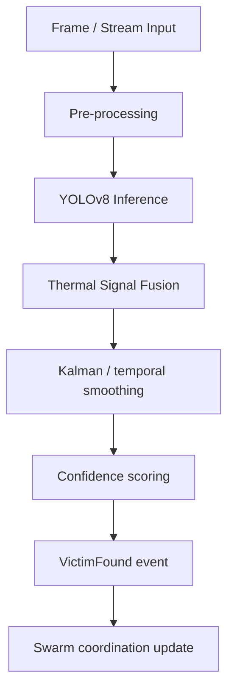

### What the pipeline should report

- bounding boxes,
- class confidence,
- fused confidence,
- detection persistence,
- and whether the alert is actionable.

### Why fusion matters

A single frame should not be treated as truth when a swarm is operating in a noisy field. Fusing RGB and thermal signals improves signal quality and helps the mission logic avoid premature handoff or false positives.


## ROS2 / PX4 / Hardware Bridge

The repository is valuable because it does not stop at visualization. It provides clear seams where real systems can be connected.

### ROS2 bridge

The ROS2 bridge should translate mission logic into topic-level interactions such as:

- velocity commands,
- camera frames,
- thermal sensor data,
- IMU readings,
- and status updates.

### PX4 bridge

The PX4 bridge should support:

- mode switching,
- guided flight,
- auto mode,
- RTL / fail-safe return,
- and command streaming.

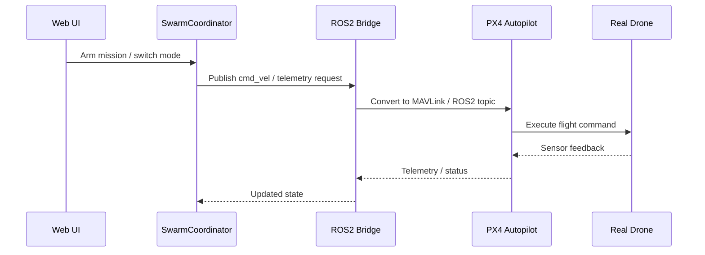

### Bridge expectations

The bridge should be explicit about:

- message format,
- latency handling,
- reconnection behavior,
- safety boundaries,
- and whether a command is simulation-only or hardware-eligible.

---

## Mobile Companion App

The mobile app is not just a duplicate view. It should function as a field control surface for mission supervisors.

### Mobile use cases

- mission monitoring,
- alert acknowledgment,
- scenario selection,
- simplified team status,
- and emergency action display.

### Mobile design goals

- quick startup,
- readable telemetry cards,
- touch-friendly controls,
- compact charts,
- and connection resilience.

### Recommended mobile panels

- current scenario,
- swarm size,
- active relay chain,
- vision alerts,
- battery and health summaries,
- and hardware connection indicators.


## Performance Targets & Benchmarks

A technical README should explain not only what the system does, but what “good” looks like.

### Suggested performance goals

- **60 FPS** in the web viewer under typical load,
- stable behavior with **100 agents** in the scene,
- coordination latency below **sub-100 ms** in normal conditions,
- vision processing near **real-time** for medium-resolution streams,
- and graceful degradation under degraded network conditions.

### Performance dashboard values

Track these metrics in the UI or logs:

- frame time,
- update loop time,
- state replication delay,
- heartbeats per peer,
- packet loss estimate,
- active relay count,
- and vision inference latency.

### Example benchmark table

```text
Subsystem              Target
--------------------    -------------------------
UI rendering            60 FPS
Physics step            30-60 Hz
Consensus updates       <100 ms
Vision inference        real-time on WASM
Peer discovery          fast enough for demo
Reconnect time          a few seconds
```

---

## Simulation Data Model

A good simulation is only as maintainable as its data model.

### Core entities

- **Agent**: one drone or robot instance.
- **Mission**: the active scenario and its current phase.
- **PeerState**: identity, role, health, and timestamps.
- **NetworkLink**: latency, loss, and hop distance.
- **VictimEvent**: detection outcome and confidence.
- **RelayChain**: ordering of relay nodes.
- **TelemetrySample**: periodic physics or sensor data.

### Suggested state shape

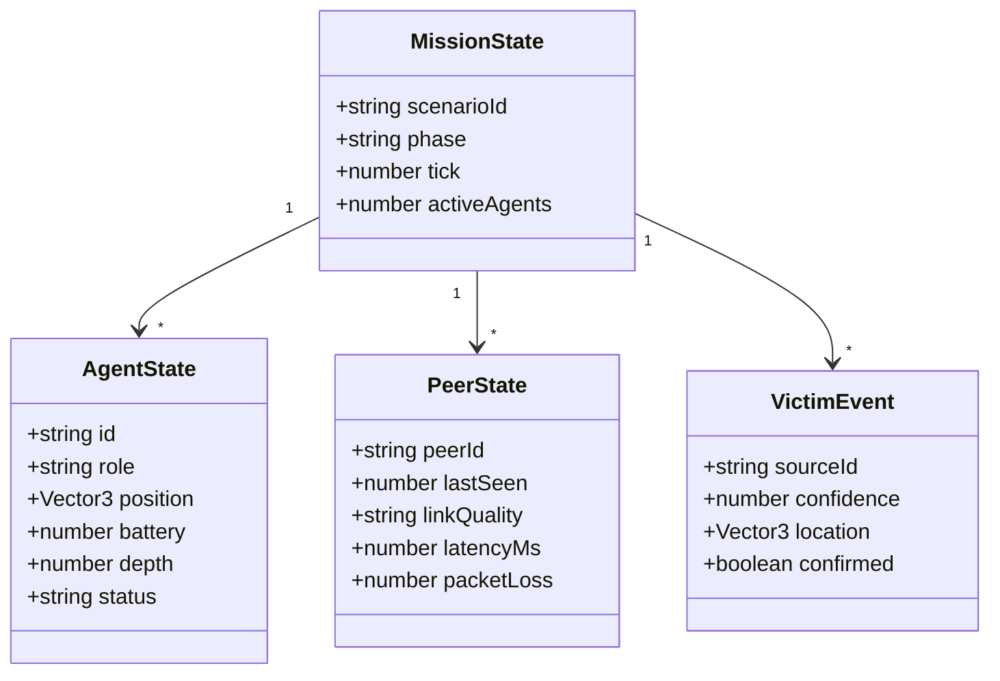

### Data modeling advice

Keep UI state and simulation state separate where possible. The UI can derive display-friendly projections, while the simulation retains canonical values.


## Rendering Pipeline

This repository’s visual impact matters. A technical README should explain how the 3D experience is structured so contributors know where to improve it.

### Rendering goals

- make drones readable in motion,
- distinguish roles visually,
- keep the scene legible at a glance,
- show network relationships,
- and present mission-critical information without clutter.

### Recommended visual encodings

- **Explorer**: bright accent color and motion trail.
- **Relay**: stable color and anchored iconography.
- **Standby**: neutral or dimmer appearance.
- **Failed node**: desaturated, blinking, or collapsed state.
- **Victim**: high-contrast marker with confidence ring.
- **Active link**: glowing line or pulse between peers.

### Rendering pipeline diagram

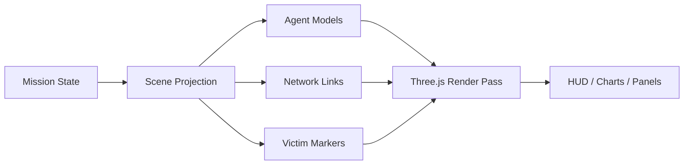

### A note on clarity

The 3D view should not merely be pretty. It should help answer:

- who is connected to whom,
- which drone is making decisions,
- where the mission is headed,
- and what broke when something fails.

---

## State Management

The stack uses Zustand, which is a good fit for a simulation that needs fast updates and clear slicing of concerns.

### Recommended store slices

- simulation slice,
- agent slice,
- mission slice,
- network slice,
- vision slice,
- UI slice,
- and hardware bridge slice.

### Store responsibilities

- hold canonical interactive state,
- support derived selectors,
- broadcast state changes efficiently,
- and avoid deep prop drilling.

### Example state flow

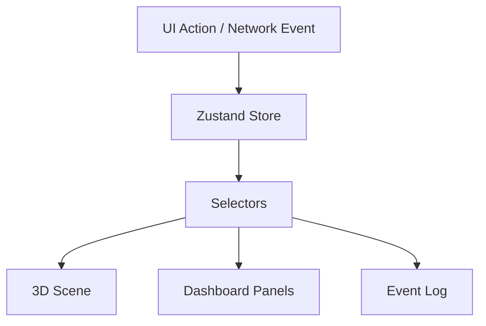

### Best practices

- normalize lists by ID,
- store timestamps for freshness,
- keep derived values as selectors rather than duplicated state,
- and isolate temporary UI state from mission-critical simulation state.


## Deployment

The deployment model should support both development and demo use.

### Web deployment

The web app should build cleanly and deploy to a static or edge-friendly hosting environment.

```bash
npm run build
npx vercel deploy
```

### Mobile deployment

The mobile companion app can be shipped via Expo / EAS build flows.

```bash
cd mobile
eas build --platform all
eas submit
```

### Hardware deployment

Hardware-related services should remain separable from the web demo so the repo can be shown safely even when live hardware is absent.

### Deployment checklist

- build passes,
- environment variables are defined,
- model assets are accessible,
- scenario assets are bundled,
- and bridge endpoints are documented.

---

## Development Workflow

A clear development workflow is crucial for a repo that includes simulation, rendering, networking, and hardware bridges.

### Local setup goals

- clone repository,
- install dependencies,
- run the web app,
- enable a single scenario,
- and iterate without manual rebuilding.

### Suggested workflow diagram

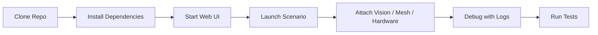

### Developer ergonomics to prioritize

- hot reload,
- strongly typed interfaces,
- linting and formatting,
- deterministic replay where possible,
- and clear separation of demo data from runtime data.

### A useful contributor habit

When changing a scenario, update all three layers:

1. the model or logic,
2. the visual representation,
3. and the README or docs if user-facing behavior changes.


## Testing Strategy

The repo already signals that testing matters. A strong technical README should make the test surface obvious.

### Testing layers

1. **Unit tests**  
   Validate isolated state logic, role assignment, confidence scoring, and helper functions.

2. **Integration tests**  
   Verify that the scene, store, and coordination layer work together.

3. **E2E tests**  
   Confirm that a scenario can start, run, and finish through the UI.

4. **Vision tests**  
   Check inference outputs and visualization correctness using fixed inputs.

5. **Replay tests**  
   Confirm the simulation behaves consistently over repeated runs.

### Test matrix example

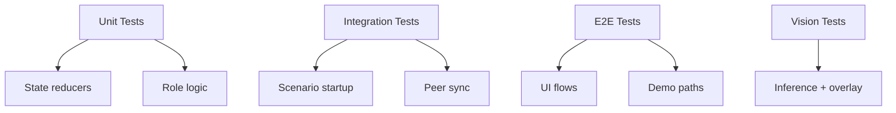

### What to document in tests

- expected startup conditions,
- known race conditions,
- simulated packet loss,
- hardware bridge stubs,
- and success criteria for each scenario.

---

## API Reference

A README should include a compact API reference so future contributors know where to begin.

### SwarmCoordinator

Common responsibilities:

- create agents,
- inject failures,
- compute mission state,
- vote or select routes,
- and expose scenario state.

Example conceptual API:

```ts
spawnAgent(config: DroneConfig): AgentId
injectFailure(id: AgentId): void
votePath(target: Vector3): Promise<Vector3>
getScenario(id: string): ScenarioState
```

### YOLODetector

Common responsibilities:

- process frames,
- emit victim candidates,
- fuse thermal and RGB evidence,
- and smooth outputs over time.

Example conceptual API:

```ts
detect(stream: MediaStream): AsyncGenerator<Victim>
fuseThermal(rgb: Victim[], thermal: Float32Array): FusedVictim[]
```

### Tashi mesh helpers

Expected coordination utilities:

- announce presence,
- send heartbeat,
- mark peer stale,
- promote relay,
- assign explorer,
- and replicate mission state.


## Observability & Debugging

A compelling mission dashboard should make debugging easier, not harder.

### Recommended observability surfaces

- event log timeline,
- peer table,
- relay chain view,
- mission phase indicator,
- frame rate counter,
- network quality graph,
- vision confidence trend,
- and hardware bridge status.

### Debugging workflow

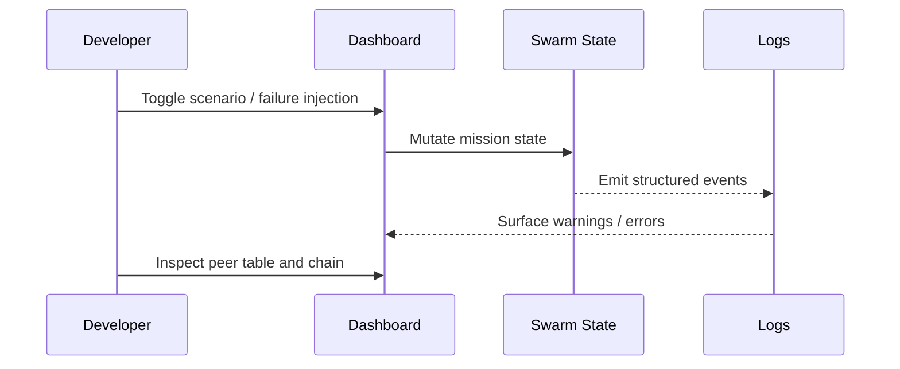

### Troubleshooting checklist

- If the scene freezes, check frame budget and object count.
- If peers vanish, check heartbeat timeout and link quality.
- If a victim is detected but not acted upon, check state transitions.
- If hardware commands are not reflected, check the ROS2/PX4 bridge config.
- If mobile and web disagree, inspect which state slice is canonical.

---

## Security & Failure Modes

This project is a simulation platform, but it still benefits from explicit failure thinking.

### Failure modes to design for

- central server unavailable,
- one peer disappears,
- multiple peers disappear,
- vision model produces a false positive,
- network latency spikes,
- or a bridge endpoint becomes unreachable.

### Security and robustness principles

- Keep command boundaries clear.
- Avoid pretending a stale node is fresh.
- Treat hardware commands as privileged actions.
- Ensure state changes have provenance.
- Make failure visible in the UI.

### Safe degradation examples

- if consensus is delayed, continue with last-known-good state;
- if vision is unavailable, fall back to manual mission control;
- if hardware bridge is down, keep the simulation alive;
- if a relay fails, re-route and continue.


## Hackathon Demo Script

A strong README should make it easy for judges to understand the intended flow.

### Recommended 2:45 demo sequence

```text
0:00  Landing → scenario selection
0:15  Warehouse scenario → restocking begins
0:45  Predator evasion → threat triggers scatter
1:15  Victim rescue → vision + consensus demo
1:45  ROS2 live bridge → hardware/teleop view
2:15  Mobile app → field visibility
2:30  Q&A → architecture, failure handling, roadmap
```

### Demo goals

The demo should prove three things:

1. The system is visually polished.
2. The system is technically serious.
3. The system is built for failure, not just for ideal conditions.

---

## Roadmap

A roadmap helps readers understand what is already done and what is still evolving.

### Near-term

- improve scene readability,
- add richer telemetry overlays,
- polish scenario transition UX,
- expand failure injection tools,
- and harden role transition logic.

### Mid-term

- support more agent types,
- add richer environment hazards,
- improve replay and deterministic testing,
- add scenario presets,
- and expand hardware compatibility.

### Long-term

- multi-site deployments,
- richer consensus-backed task bidding,
- mixed reality / AR overlays,
- and stronger cross-device operator tooling.

---

## Contributing

Contributions should preserve the repo’s overall design: clear state ownership, clear mission flow, and strong visual feedback.

### Suggested contribution rules

- keep commits focused,
- document scenario changes,
- add tests when logic changes,
- avoid introducing hidden global state,
- and prefer readable abstractions over clever ones.

### Good pull request content

- summary of behavior change,
- screenshots or short clips,
- test evidence,
- and notes about any new environment variables or assets.

---

## License

MIT License.

---
